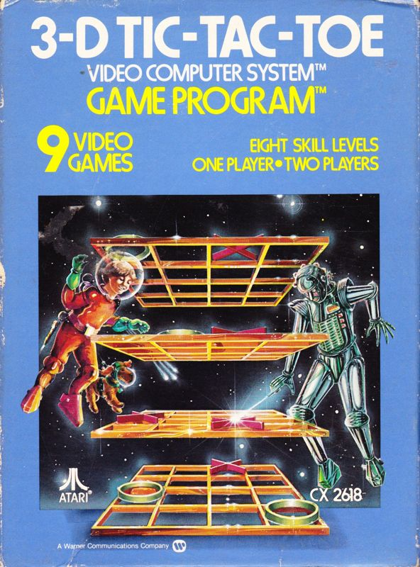

# RIVER RAID

## ¿Por que este juego?
River raid es un juego tipo shoot ´em up y scrolling shoter por lo que sus mecanicas son muy simples sin embargo considero que eso es sufciente para lograr un buen jurgo retro, elegí este juego ya que realmente quiero aprender a programr con js por lo que considero que es un reto adecuado para aprender como funcina el lenguaje.

## Moodboard de referencia

## Historia de River Raid

En aquella época los juegos los hacía una sola persona: diseño, programación, gráficos y sonido. El primer proyecto de **Carol Shaw** en Atari fue un juego de polo para una campaña publicitaria de una nueva colonia de Ralph Lauren. A pesar de terminar el juego y enviarlo, no recibió ningún tipo de feedback y el juego no salió a la venta hasta años después.

El primer juego diseñado por Carol Shaw que salió a la venta fue 3D tic tac toe, un cuatro en raya en 3D. Después llegó Video Checkers, un juego de damas. A estos proyectos le siguió la adaptación del juego Super Breakout a la consola Atari 2600 y también creó una calculadora para Atari 800.

Tras dos años en Atari, en 1980 abandonó la empresa para trabajar en Tandem. La industria de los videojuegos estaba sufriendo un bache y trabajar en Atari no era tan divertido como solía, según explica ella misma. De manera que cuando un antiguo compañero de Atari le propuso unirse a él en Tandem, cambió de trabajo.

En la nueva empresa no se dedicó a los videojuegos, sino que utilizó sus conocimientos de lenguaje ensamblador para trabajar en un procesador. Su etapa en Tandem, sin embargo, fue efímera. Menos de año y medio después de empezar allí, recibió una llamada desde Activision (empresa creada por un grupo de ex trabajadores de Atari) invitándola a unirse a su equipo.

A principios de 1982 Carol Shaw fichó por Activision donde creó el que fue el mayor éxito de su carrera: River Raid. Se trata de un juego de acción en el que el objetivo es avanzar río arriba controlando un avión que va acabando con los enemigos que se van presentando.

 

River Raid es un shooter vertical que fue lanzado para Atari 2600 bajo el sello de Activision y que su éxito hizo que tuviese conversiones para Atari 5200, Atari 8-bit, ColecoVision, Commodore 64, Intellivision, MSX y ZX Spectrum; además de diversas apariciones en máquinas posteriores a través de recopilatorios. De igual manera, hubo una secuela en 1988 pero ya sin la participación de Shaw. En River Raid manejamos un caza militar que sobrevuela un río en el cual tendremos que ir acabando con los enemigos que nos salgan al paso, eliminar obstáculos que se nos pongan enfrente y todo esto echándole de forma permanente un ojo a nuestro tanque de combustible.

River Raid destaca dentro del catálogo de Atari 2600 a nivel técnico por varios motivos. Primeramente, los movimientos de los enemigos no siguen un patrón fijo sino que realizan movimientos según los realice el jugador en busca de enfrentarse con él, en una implementación de inteligencia artificial tosca pero efectiva. Los gráficos, dentro de las limitaciones de la máquina, nos dejan diferenciar los distintos elementos claramente y cabe destacar la suavidad del scroll, cuya fluidez no se ve afectada con la aceleración y desaceleración del avión. Por otro lado, los puntos de guardado, el continuado sonido del motor o el hecho de que el videojuego no se bloquee cuando se llega al límite máximo de puntuación, son factores que demuestran que este videojuego fue realizado con más dedicación que la media del catálogo de la consola de Atari.

